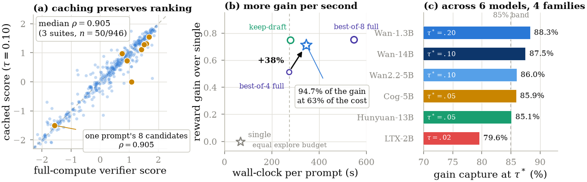
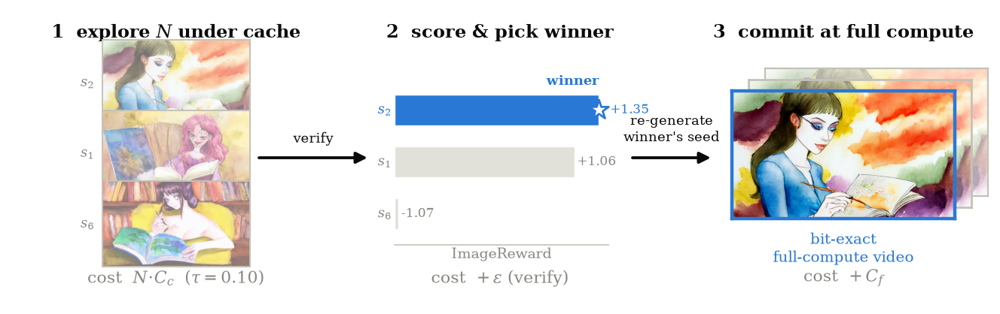
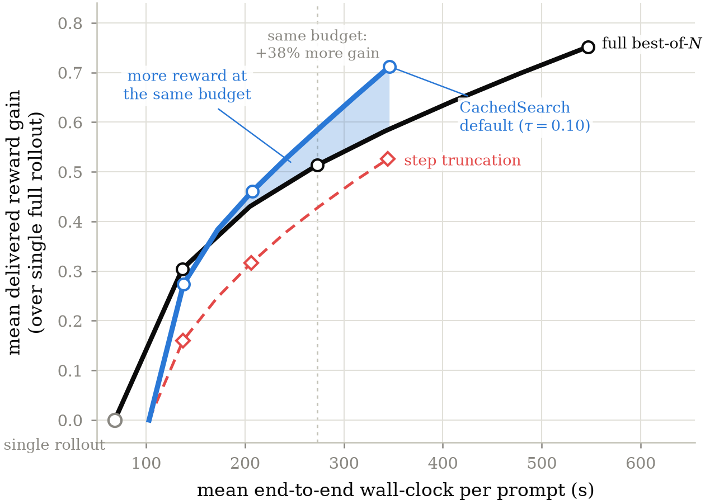

<p align="center">
  <picture>
    <source media="(prefers-color-scheme: dark)" srcset="assets/logo-dark.png">
    
  </picture>
</p>

<p align="center">
  Training-free cached exploration for test-time search in video diffusion
</p>

<p align="center">
  Paper (arXiv, coming soon) &nbsp;·&nbsp;
  <a href="https://shreshthsaini.github.io/CachedSearch">Project page</a>
  &nbsp;·&nbsp; Blog (coming soon)
</p>

<p align="center">
  
  
  
  
</p>

<p align="center">
  
</p>

- Ranking survives caching: median Spearman rho is 0.905, with 72% top-1 agreement on VBench.
- Ranking failures are self-limiting because they concentrate where candidates are nearly tied.
- Explore cheap plus commit full retains 94.7% of the best-of-8 gain at 63% of the cost.
- CachedSearch works with any published cache engine and transfers across six models in four families.

## How it works

<p align="center">
  
</p>

Generate every candidate with a training-free cache enabled.<br>
Score the cached drafts with the verifier used by the search procedure.<br>
Select the seed with the highest draft score.<br>
Regenerate only that seed at full compute.<br>
Return the full-compute video, so caching affects selection but not delivery quality.

```text
drafts = [cached_generate(prompt, seed) for seed in seeds]
winner = seeds[argmax(verifier(video, prompt) for video in drafts)]
return full_generate(prompt, winner)
```

## Use it on your model

CachedSearch is a wrapper around generation, not a new model. If you already
run best-of-N search (or you generate a few candidates and pick one by hand),
you can adopt it in three steps.

**1. Install and import.**

```bash
pip install -r requirements.txt
```

```python
from cachedsearch import cached_search
```

**2. Replace your search loop.** Wherever you generate N candidates and keep
the best, call `cached_search` instead. It takes any diffusers video pipeline
and any verifier you already trust.

```python
result = cached_search(
    pipe,                       # your diffusers video pipeline
    "a red fox running through deep snow",
    verifier=my_scorer,         # (frames, prompt) -> float, higher is better
    n=8,                        # search width
    tau=0.10,                   # caching threshold (see step 3 for other models)
    mode="commit",              # regenerate the winner at full compute
)

result.video          # delivered video: a genuine full-compute sample
result.seed           # the seed that won
result.total_seconds  # about 63% of what full best-of-8 costs
```

Internally this generates all N candidates with caching on, scores the cheap
drafts, then regenerates only the winning seed with caching off. Because the
sampler is seed-deterministic, the delivered video is bit-identical to what
full-compute search would have returned whenever both pick the same seed:
caching changes which candidate you select, never the quality of what ships.

A runnable end-to-end script is in [`examples/run_wan.py`](examples/run_wan.py).

**3. Calibrate `tau` if your model is not Wan.** The threshold is the one
model-specific number. Fidelity tracks architecture family rather than
parameter count, so calibrate once per family and reuse it across sizes.

```bash
python examples/calibrate_new_model.py --model <hf-id> --prompts your_prompts.txt
```

This runs the paper's protocol in miniature (25 prompts, both compute levels)
in roughly two GPU-hours and prints the largest threshold that still retains
90% of search's gain. Starting points we measured: Wan family 0.10,
CogVideoX 0.05, HunyuanVideo 0.05, LTX-Video 0.02. Do not copy a threshold
across families; an over-driven threshold silently degrades selection.

### Choosing the settings

| Situation | Setting |
|---|---|
| Default, quality matters | `mode="commit"`, `tau=0.10` (Wan) |
| Fidelity first, some speed given up | swap in a milder engine (TeaCache) or lower `tau` |
| Maximum savings, motion not critical | `mode="keep"` at `tau<=0.10`; expect mild motion dampening |
| Fixed budget, want more quality | keep the budget, raise `n`: capture rises with width |
| New architecture | calibrate first, never copy constants |

### Does it compose with what I already use?

Yes. CachedSearch only changes how exploration rollouts are computed, so it
sits underneath the rest of the stack: any published training-free cache works
as the engine (we measured PAB, CFG-Cache, TeaCache, and EasyCache on one
frontier), any verifier works, and pruning-based search composes
multiplicatively (we measured 3.11x exploration speedup when stacked with
mid-trajectory pruning).

## Results at a glance

Each row uses the listed cache as the exploration engine at search width 8. Cost includes the full-compute commit.

| Exploration engine | Gain capture | Cost |
|---|---:|---:|
| No caching | 100.0% | 621 s |
| PAB | 99.5% | 493 s |
| FasterCache CFG-Cache | 99.6% | 465 s |
| TeaCache | 93.2% | 365 s |
| EasyCache | 90.1% | 346 s |

<p align="center">
  
</p>

At similar exploration cost, caching retains 90.1% of search gain, while 25-step truncation retains 72.6%.

## Reproduce the paper

```bash
# one gate-grid arm (50 prompts x 8 seeds, full and cached rollouts)
python code/experiments/b1_gate.py --variants full,cached --tau 0.10 --tag v0

# regenerate every figure from the score records
python code/paper_figs/make_figs.py
python code/paper_figs/make_fig_hero.py
```

Generation needs a CUDA GPU with enough memory for your backbone (we used
NVIDIA GH200). Set `CACHEDSEARCH_RESULTS` to choose where records are written.

## Repository layout

```text
cachedsearch/        the drop-in API (cached_search, calibrate_tau)
examples/            runnable scripts: search on Wan, calibrate a new model
code/videogen1/      caching wrapper and generation helpers
code/experiments/    experiment runners used for the paper
code/paper_figs/     figure and table generation from score records
data/                gate-grid prompts and seeds
results/            per-candidate score records (added on release)
assets/              logo and figures
```

## Data

[`data/prompts_gate50.csv`](data/prompts_gate50.csv) contains all 50 gate prompts crossed with seeds 0 through 7. It has 400 rows with the columns `prompt_id`, `seed`, and `prompt`. Official VBench and VBench-2.0 prompt lists are linked in [`data/README.md`](data/README.md) and are not redistributed.

## Acknowledgments

We sincerely thank the authors and open-source teams whose models, acceleration methods, evaluators, and benchmarks made this work possible: [Wan2.1](https://github.com/Wan-Video/Wan2.1), [CogVideoX](https://github.com/THUDM/CogVideo), [HunyuanVideo](https://github.com/Tencent/HunyuanVideo), [LTX-Video](https://github.com/Lightricks/LTX-Video), [TeaCache](https://github.com/ali-vilab/TeaCache), [PAB and VideoSys](https://github.com/NUS-HPC-AI-Lab/VideoSys), [FasterCache](https://github.com/Vchitect/FasterCache), [EasyCache](https://github.com/H-EmbodVis/EasyCache), [ImageReward](https://github.com/THUDM/ImageReward), [VideoScore](https://github.com/TIGER-AI-Lab/VideoScore), and [VBench](https://github.com/Vchitect/VBench). Their public releases made it possible to study cached exploration across a broad and reproducible video generation ecosystem.

## Citation

```bibtex
@article{saini2026cachedsearch,
  title   = {CachedSearch: Training-Free Cached Exploration for Test-Time Search in Video Diffusion},
  author  = {Saini, Shreshth and Birkbeck, Neil and Wang, Yilin and Adsumilli, Balu and Bovik, Alan C.},
  year    = {2026},
  note    = {arXiv id TBD}
}
```

## License

The code and release materials are available under the [MIT License](LICENSE).
